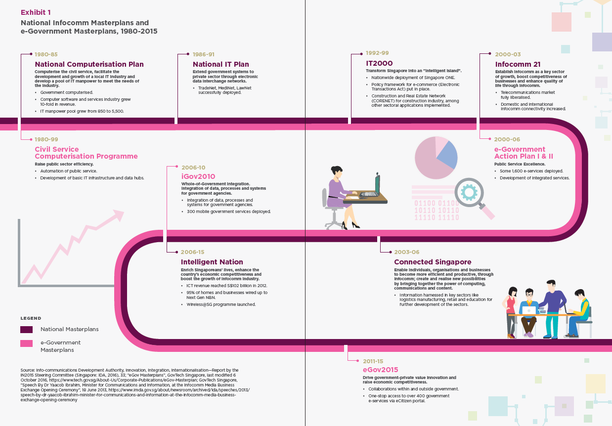

# Introduction

## What is Smart Nation?

1. Smart Nation is a transformed Singapore where people will be more empowered to live meaningful and fulfilled lives, enabled seamlessly by technology, that offers exciting opportunities for all. It is where businesses can be more productive and seize new opportunities in the digital economy. It is a nation which collaborates with our international partners to deliver digital solutions and link and benefit people and businesses across boundaries. As PM Lee described it at the launch of Smart Nation in November 2014, it is a nation where “we can create possibilities for ourselves beyond what we imagined possible.” 

test

## Why Smart Nation?

{:start="2"}

2.	We are at a most exciting and dynamic time in human history, and stand at the cusp of a new industrial revolution fuelled by digital technologies. Technological disruption is a global force we must confront and harness to our advantage. Today, developments in digital technologies are rapidly advancing, and the next frontier of technologies – big data analytics, artificial intelligence (AI), Internet of Things (IoT) and robotics – will fundamentally transform the global economy and change the way we live, work and relate to one another.

3.	Digitalisation will be pervasive, and change life as we know it. Many of today’s institutions, norms and habits, were designed around industrialisation. Similarly, our strategies and structures today will change with technology, and our adaptability to change will determine our success and ability to stay ahead.

4.	Smart Nation is integral to Singapore’s next phase of nation building. To continue to prosper and stay relevant in the world, Singapore needs to ride the waves of the digital revolution and capture the opportunities it brings, just as we embraced globalisation before. Digitalisation presents opportunities for Singapore to enhance Singapore’s traditional strengths, address and overcome our national challenges and physical limits, be it resource constraints or an ageing population, as well as build new sources of comparative advantage for Singapore. This new era of digital transformation will power Singapore to SG100 and beyond.

5.	To achieve Smart Nation, we start from a position of strength, riding on Singapore’s early investments in technology and connectivity infrastructure, and strong institutions that are ready to seize these opportunities. Our people are also digitally literate, with a strong pool of talent who perform well in the STEM (Science, Technology, Engineering and Mathematics) disciplines.

## A Brief History of Singapore’s National Digitalisation Efforts

{:start="6"}

6.	Singapore has done this before. In our history, we have undergone two successful whole-of-nation transformations in response to digital disruption. First, with **National Computerisation** from the 1980s to early-1990s, to transform Singapore into a regional centre for computer software development and services. Second, with the **growth of the info-communications industry** from the mid-1990s to early-2010s, to transform Singapore into a hyper-networked, global hub for services.

7.	It was in the early 1980s that the Government recognised computerisation as an essential tool for competing with the rest of the world, and mobilised the nation to embrace new technology. Since then, six national Info-communications Technology (ICT) masterplans have been launched. In the formative years, the focus was to computerise government agencies and drive up the quality and number of IT professionals in Singapore. Subsequent masterplans focused on extending computerisation and connectivity to the private sector.

_Source: Centre for Liveable Cities_

{:start="8"}

8. While each masterplan had a different emphasis to address challenges of the period, the underlying objectives have been clear and consistent – to guide the use of ICT to enhance Singapore’s international competitiveness, upgrade the skills of citizens especially the workforce, improve service standards, and attract knowledge-intensive activities.

## What Would a Smart Nation Look Like?

{:start="9"}

9. Today, Singapore is at another pivotal moment in its digital transformation journey. The pace of technological invention and innovation is accelerating at an unprecedented rate, and we must do better to fully harness this power and potential to improve lives and create opportunities. 

_Source: Smart Nation and Digital Government Office_

{:start="10"}

10.	Our Smart Nation journey endeavours to transform Singapore through technology. Technology is only a means to an end, to enable significant improvements in how we live, work and play. We cannot simply apply the latest technologies on top of our existing processes and organisations. It will require a fundamental rethink of our long-held assumptions and how we operate.

11.	As a nation and city-state, Singapore’s Smart Nation initiative is unique among the efforts of many other smart cities. Singapore’s single layer of Government not only seeks to improve city and municipal services through technology, but has the capacity to drive transformation at the national scale. At a national level, we are able to drive economic and civic engagement, as well as enable efficient and effective planning and administration. At the same time, we can drive transformation in critical areas such as energy management, national security, trade and foreign relations. We are able and ready to make bold changes that will improve all aspects of our people’s lives.

12.	Our priority is to harness technology to address national challenges and drive transformation in key domains: **health, education, transport, urban solutions, and finance**.
  <ul>
    <li> <b>Health.</b> Our healthcare system will move beyond healthcare to health, as Singaporeans will be better equipped and empowered to take care of their own health. Healthcare services, where they are needed, will be delivered efficiently. Singaporeans are already using wearable devices or smartphones to monitor their health and activities, and this data can empower individuals and inform service delivery. </li>

    <li> <b>Education.</b> Digital technology unlocks a new realm of self-directed and collaborative learning. Relationships between students, teachers and parents, as well as capabilities of the physical infrastructure are augmented to create a holistic and conducive environment for effective learning. Routine and repetitive tasks are automated to help educators focus on the work that matters. In the long run, we will need to rethink our philosophies, content and modality of learning as technology evolves. </li>

    <li> <b>Transport.</b> Data analytics, smart systems and autonomous vehicles are key solutions for the future of transport planning and operations. Our roads and transport system will be optimised, making traffic smoother, public transport more comfortable and reliable, and the air cleaner with less need for private cars. </li>

    <li> <b>Urban Solutions.</b> Our homes and estates will be safer, more comfortable and more sustainable. The use of sensors and smart systems will improve the effectiveness of municipal services, save energy and ensure sustainable use of resources. </li>

    <li> <b>Finance.</b> Singapore will continue to be a leading regional and global financial hub, powered by financial institutions that readily adopt fintech solutions for better customer service, greater efficiencies in trade finance, strengthened supervision and reduced compliance cost. </li>
  </ul>

{:start="13"}

13.	At its core, Smart Nation is about empowering **our people**. Understandably, there might be some fears and tensions about technology destabilising livelihoods, raising costs and increasing vulnerabilities. However, if we identify these challenges and tackle them head on, technology can result in better jobs and business opportunities, more security and improvement of livelihoods.

14.	Everyone is part of Smart Nation, and will be better equipped to imagine, design and implement, as well as enjoy the opportunities and conveniences of a digital society. This means having the means to transact digitally, the skills and confidence to use technology, and the agility to adapt to change and keep up with the latest technologies to achieve a better quality of life, as well as contribute to innovations in the digital era. This will put us in good stead for an ever-changing global environment.

## Who Contributes to Smart Nation?

{:start="15"}

15.	Smart Nation is for **Singapore, and Singaporeans**. It requires a whole-of-nation effort, involving every Government agency, every business, and also our people. The Government will take responsibility for the digital transformation of Government functions and services, and businesses must step up to transform and keep up with the winds of technological change. At the same time, Government will partner the civil society to drive the digital readiness and harness technology for stronger social cohesion.

## How Do We Become a Smart Nation?

{:start="16"}

16.	Singapore has laid out mutually-reinforcing plans to build a **Digital Economy, Digital Government and Digital Society**, involving the public, private and people sectors. This means every industry, business and government agency stepping up to accelerate its digitalisation efforts, to build capabilities and solutions that will propel the nation forward. This whole-of-nation movement will be powered by a society of digitally ready citizens and communities, confident and eager to learn about and adopt digital technologies.

17.	Strong **System Foundations** must be in place. Cybersecurity will be the bedrock to secure all our digital efforts, protect users and inspire trust in a technological future for our nation. We need a robust and flexible data management systems and processes to ensure secure data sharing for policymaking, service delivery and operations. Singapore also needs to invest in digital infrastructure to enable the full-scale industrialisation of digital technologies and reap maximum efficiencies and benefits.

18.	We will level up our **People and Culture** to best capture this opportunity. Talent has always been Singapore’s advantage. As a nation, we are renewing our emphasis on building a technology culture. Individuals will need to foster a mind-set of lifelong learning to embrace change and strengthen our capabilities. Organisations will need to rethink their operating models to be more agile and bold. As a nation, we will need to strengthen our collaborations with the world. Every member of society must benefit from the opportunities and advancements that a Smart Nation will bring.

19.	This effort will be exemplified by a portfolio of major national projects, such as building digital infrastructure and improving service delivery. At the same time, we will continue to provide the environment and opportunities for collaboration and experimentation with frontier technologies. Our measure of success is how individuals and businesses are better served and better empowered to achieve their own success. Each project will involve the public, private and people sectors working closely to collectively transform Singapore.
