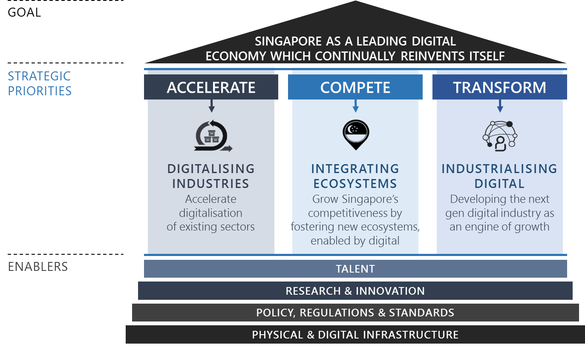
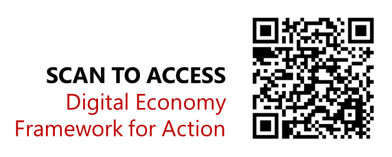
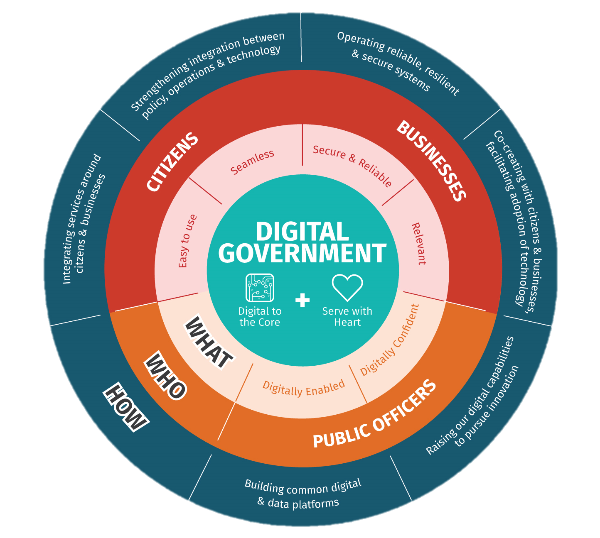
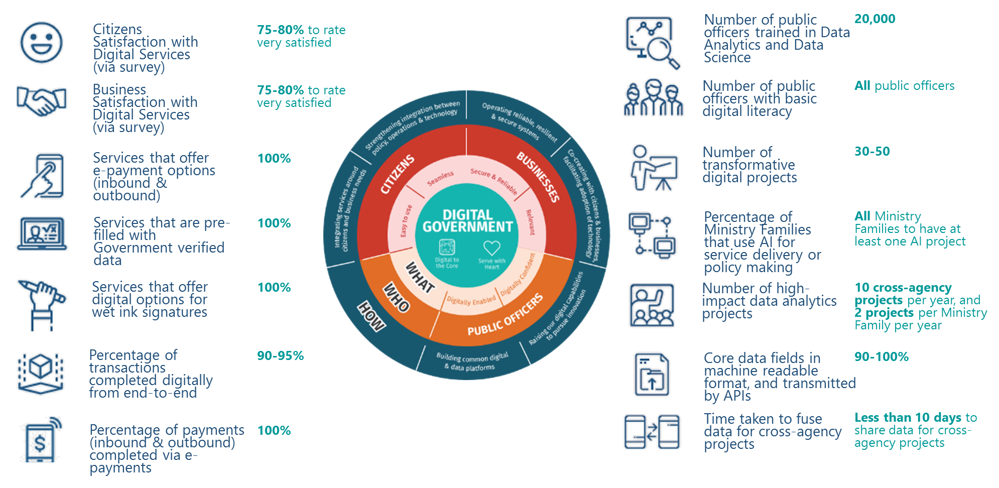
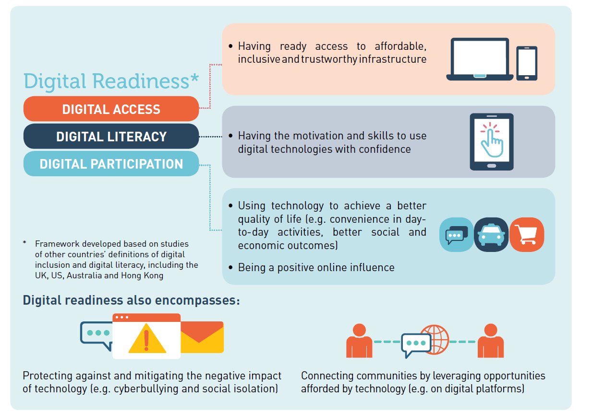
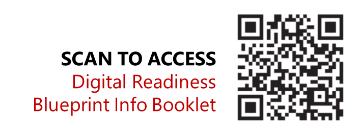

# Digital Government, Digital Economy and Digital Society

{:start="20"}

20.	To facilitate the transformation of Singapore, the government has outlined broad plans to transform our Economy, Government and Society through the **Digital Economy Framework for Action, Digital Government Blueprint**, and the **Digital Readiness Blueprint**. A Digital Government will provide the environment and drive enablers to shape the Digital Economy and a Digital Society. A Digital Economy will work closely with Digital Government to support the digitalisation of Government service delivery and build industry capability for future transformation needs. We are also doing further work to develop a holistic approach to cultivate a Digital Society which is confident to harness technology.

## Digital Economy

{:start="21"}

21.	Going digital is a national imperative for a better future for Singaporeans. Digitalisation is about enabling new possibilities across the economy, with business growth and better jobs. Grasping these opportunities will allow Singapore to develop new comparative advantages and remain a smart and thriving nation that continually attracts investments and talents to her shores. The Singapore Digital (SG:D) movement was launched to spur our digitalization efforts, with the Government, companies, organisations and individuals to reap the benefits of a digital economy. Our vision is to be a leading digital economy that continually reinvents itself in the fourth industrial revolution.

22.	We do this via accelerating the digital transformation of existing economic sectors, fostering new ecosystems enabled by digital technologies, and developing a next-generation digital industry in sectors such as cybersecurity as an engine of growth. This is outlined in the **Digital Economy Framework for Action** by the Infocomm Media Development Authority (IMDA).

### The Digital Economy Framework for Action

#### 1. Accelerate: To accelerate the digitalisation of our existing industries for productivity improvements, efficiency gains and new revenue opportunities

Our economic agencies have a bold vision of digitalizing every industry and every business, raising productivity and efficiencies to grow the economy. In 2017, the Government rolled out 23 **Industry Transformation Maps (ITMs)** as part of the efforts under the Committee of Future Economy. Supporting these ITMs are Industry Digital Plans to facilitate digitalisation in selected industries. 

Our SMEs are an important foundation of the economy. The **SMEs Go Digital** programme helps to make going digital simple for SMEs. The Industry Digital Plans for SMEs (IDPs), which are aligned to the Industry Transformation Maps, provide SMEs with step-by-step guidance on the digital technologies to use at each stage of their growth – SMEs can self-assess their digital readiness, seek advice on their digitalisation journey, deploy curated solutions, participate in industry-led pilot projects and engage project management services to implement their digital projects. 

In addition, IMDA is working with businesses and government agencies on impactful projects that can accelerate the pace of digital change for industry sectors. These include innovative concepts in urban logistics such as federated lockers for more convenient last mile delivery, the Kampong Glam precinct-level transformation, and the **Punggol Digital District** which will be a vibrant and inclusive district underpinned by cutting edge technology and a hub for key growth sectors of the Digital Economy.

#### 2. Compete: To enhance our economic competitiveness by fostering new integrated ecosystems converged around customers’ needs.

Digitalisation is hastening the blurring of sector boundaries. Enabled by digital platforms, customers can increasingly dictate how products and services are designed and delivered around their needs, resulting in the formation of new business ecosystems and market intermediaries. These new ecosystems will form the foundation of future industries. Singapore aims to foster a conducive environment for the growth of such integrated ecosystems and support our businesses to innovate and evolve their business models, and become competitive in the global marketplace.

To do so, we will support the innovation ecosystem, such as through the **Open Innovation Platform (OIP)**. With the support of a structured innovation process, the OIP facilitates collaboration between problem owners and Infocomm Media (ICM) companies to accelerate the development of innovative, new and scalable solutions that address real business problems.

#### 3. Transform: To develop the next generation digital industry as an engine of growth for the economy, and a driver of digitalisation across all industries.

Last, but not least, we want to transform the ICM industry to be a key growth driver of Singapore’s digital economy. IMDA will continue in this area and create digital companies and capabilities of the future. As a nation, we are building deep capabilities in four frontier technology sectors – Data Science and Artificial Intelligence (AI), Cybersecurity, Immersive Media as well as Internet of Things (IOT) and Future Communications Infrastructure.  

**Accreditation@SG:D** aims to level the playing field for promising Singapore-based technology companies to win projects, grow and compete in the global market by helping them establish their credentials and facilitating access to Government and large enterprise buyers. It gives accredited companies the opportunity to be better-recognised overseas with a trusted Singapore branding. The Government will also facilitate overseas growth of Singapore companies through targeted programmes for Singapore enterprises, in collaboration with agencies such as Enterprise Singapore. 

The **Singapore Economic Development Board, Enterprise Singapore**, and **Infocomm Media Development Authority** will jointly take the lead in engaging leading digital companies globally and grooming Singapore-based digital companies, to create good jobs, accelerate the building of capabilities and encourage technology collaborations in our local ecosystem.

In addition, four cross-cutting enablers will support these pillars of growth:

• **Talent**: To continually up-skill, re-skill and raise the digital capabilities of the workforce.

• **Research and Innovation**: For firms to innovate and leverage intellectual property for competitive advantage, harnessing the capabilities in our research and innovation community. 

• **Policy, Regulations and Standards**: To ensure that our policy and regulatory environment, including the environment for data innovation, is globally competitive in a digital world. 

• **Physical and Digital Infrastructure**: To ensure that connectivity, platforms, data and other infrastructure support the growth of the digital economy.

    

## Digital Government

{:start="23"}

23.	The Singapore Government endeavours to build leaner and stronger public agencies which are digital to the core, at the global leading edge of service delivery, transformation and innovation. The government will empower public servants to continue to serve with heart, commanding strong public trust, confidence and support. Outlining the strategies and desired outcomes for this transformation is the **Digital Government Blueprint** by the Smart Nation and Digital Government Group.

### Digital Government Blueprint

The Singapore government is bold and committed in its ambition to transform itself. The **Digital Government Blueprint** is only the first statement of intent to enable a public service that is leaner and stronger, with skilled and adaptable officers at the leading edge of service delivery and innovation. It spells out how we will organise ourselves around our mission and stakeholders, rather than be bound by organisational boundaries and processes.

At the same time, we are undergoing a fundamental overhaul of our technology infrastructure to operate more nimbly and effectively, not unlike the digital giants of the world. We are moving towards a government that is able to leverage data, cloud computing and a micro-services architecture by building a **Singapore Government Tech Stack**. We are also making strategic bets in frontier technologies like artificial intelligence (AI) to ensure that our digital and physical systems are intelligent to the core. This re-engineering of our technical infrastructure will allow the Government to more efficiently and effectively collaborate with the people and private sectors to deliver policies and services. At the same time, the Government is also rethinking its manpower and workforce strategies to grow our technology talent pool, incentivise for excellence and upskill public officers with data science and AI capabilities.

The Digital Government Blueprint sets out bold targets to be achieved by 2023:

    

{:start="25"}

25.	Together, the public and private sectors will drive **sectoral masterplans** in key domains and industry sectors. These will outline how technology will be used to improve lives and create new business opportunities. These include the **Industry Transformation Maps** as well as domain roadmaps in health, education, transport and urban solutions, finance and employment? (sync with the above)

## Digital Society

{:start="25"}

25.	In a Smart Nation, Singaporeans are empowered to maximise the opportunities and leverage conveniences of a digital society to lead meaningful lives. The Government will support this by making our services more accessible, raising our people’s digital literacy, and encouraging people to participate in digital communities and platforms. To support this, the Ministry of Communications and Information has introduced a **Digital Readiness Blueprint**.

### Digital Readiness Blueprint

Digital technologies can make our daily lives more convenient and sustainable, and they can also empower us to strengthen our community bonds by enabling us to connect to and look out for one another. The Digital Readiness Blueprint, written with input from the people and private sectors, sets out recommendations for building Digital Readiness in Singapore, guided by four strategic thrusts:
<ul>
	<li>Expand and Enhance Digital Access for Inclusivity</li>
	<li>Infuse Digital Literacy into the National Consciousness</li>
	<li>Empower Community and Businesses to Drive Widespread Adoption of Technology</li>
	<li>Promote Digital Inclusion by Design</li>
</ul>

Guided by this framework, the blueprint offers 10 recommendations:

1. Make access to basic digital enablers as widespread as possible
2. Customise access package for those with specific needs
3. Identify a set of basic digital skills for everyday activities to spur take up of digital technology, especially among the less digitally savvy
4. Strengthen focus on information and media literacy to build resilience in an era of online falsehoods.
5. Ensure that our children and youth grow up to form meaningful relationships with people around them and use technology to benefit their communities
6. Encourage private and people sector organisations to amplify efforts and help more Singaporeans adopt technology
7. Provide one-on-one assistance to make it easy for Singaporeans to adopt technology, especially those who find it challenging
8. Provide support for projects that create opportunities for community participation
9. Encourage organisations to design for inclusion
10. Reach out to more Singaporeans by ensuring that relevant digital services are made available in vernacular languages

    

{:start="26"}

26.	As more public and private sector services go digital, we will all be nudged into increasingly digital behaviours. While we acknowledge that there are fears and anxieties surrounding the use technology, the speed at which we become a Digital Society is dependent on how quickly we are able to adapt. We must recognize how our daily digital behaviour contributes to better policy insights and service delivery, and actively work towards being digital individuals.

27.	As more public and private sector services go digital, we will all be nudged into increasingly digital behaviours. While we acknowledge that there are fears and anxieties surrounding the use technology, the speed at which we become a Digital Society is dependent on how quickly we are able to adapt. We must recognize how our daily digital behaviour contributes to better policy insights and service delivery, and actively work towards being digital individuals.